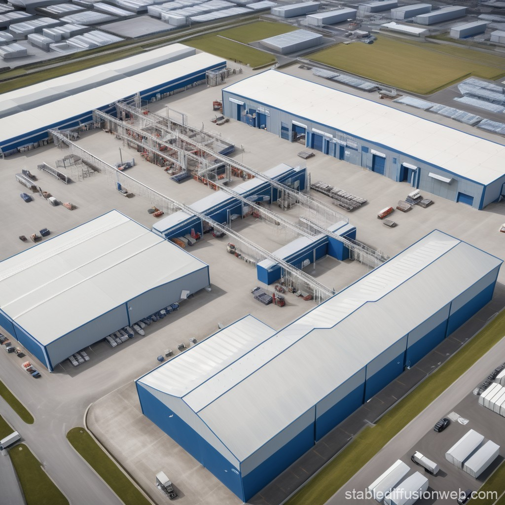

# Multi echelon inventory optimization with DDPG


This project implements a supply chain optimization system using reinforcement learning, specifically the Deep Deterministic Policy Gradient (DDPG) algorithm. It also includes a baseline (s, Q)-policy for comparison.

## Project Structure

- `generate_policy.py`: Loads a trained DDPG policy and generates transitions.
- `ddpg.py`: Implements the DDPG algorithm and training process.
- `baseline.py`: Implements the (s, Q)-policy baseline and simulation functions.
- `state.py`: Defines the State, Action, and SupplyChainEnvironment classes.
- `utils.py`: Contains utility functions for visualization and plotting.

## Key Components

1. **SupplyChainEnvironment**: Simulates a supply chain with a factory and multiple warehouses.
2. **DDPG Algorithm**: Trains a reinforcement learning agent to optimize supply chain decisions.
3. **Baseline (s, Q)-policy**: Provides a comparison point for the RL approach.
4. **Visualization Tools**: Helps analyze and compare the performance of different policies.

## Usage

1. Train the DDPG agent:
   ```
   python ddpg.py
   ```

2. Generate and analyze policy results:
   ```
   python generate_policy.py
   ```

3. Compare with baseline policy:
   ```
   python baseline.py
   ```

## Requirements

- Python 3.x
- NumPy
- Matplotlib
- Seaborn
- Ray RLlib
- Gym
